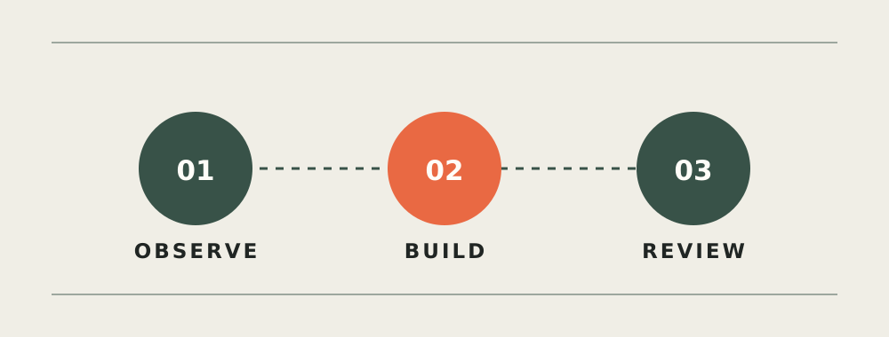

이 글은 AX Notes의 화면과 콘텐츠 흐름을 확인하기 위한 **샘플 글**입니다. 실제 조직이나 프로젝트의 경험을 설명하지 않습니다.

## 시작은 작게

매주 같은 형식으로 정리하던 공개 자료를 읽고, 세 줄로 요약하는 일을 가정했습니다. 처음부터 모든 작업을 맡기기보다 입력과 출력이 선명한 한 단계를 골랐습니다.

Agent에게 필요한 것은 화려한 지시보다 경계였습니다. 무엇을 읽을 수 있는지, 결과를 어떤 형식으로 내야 하는지, 모를 때 어디에서 멈춰야 하는지를 먼저 적었습니다.

## 사람의 검토는 어디에 둘까

첫 시도에서는 그럴듯하지만 출처가 빠진 문장이 생겼습니다. 그래서 출력에 근거 링크를 함께 남기고, 게시 전에는 사람이 확인하도록 흐름을 바꿨습니다.

작은 실험이라도 성공 기준은 적을 수 있습니다. **시간을 얼마나 아꼈는지**와 함께 **검토할 거리가 얼마나 줄었는지**를 살펴보려 합니다.
