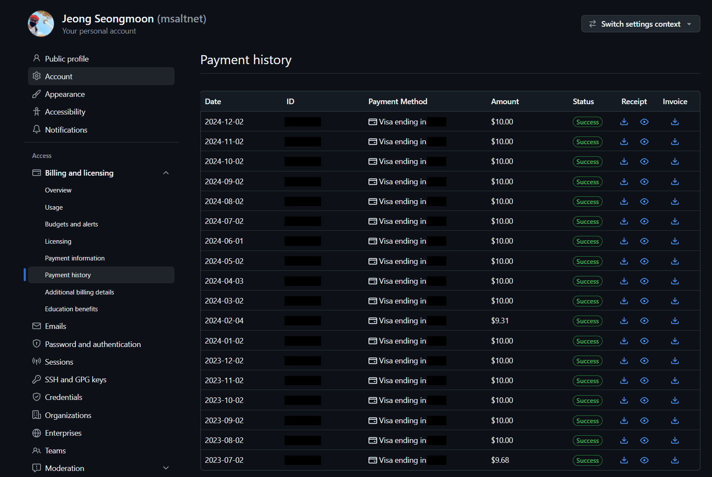
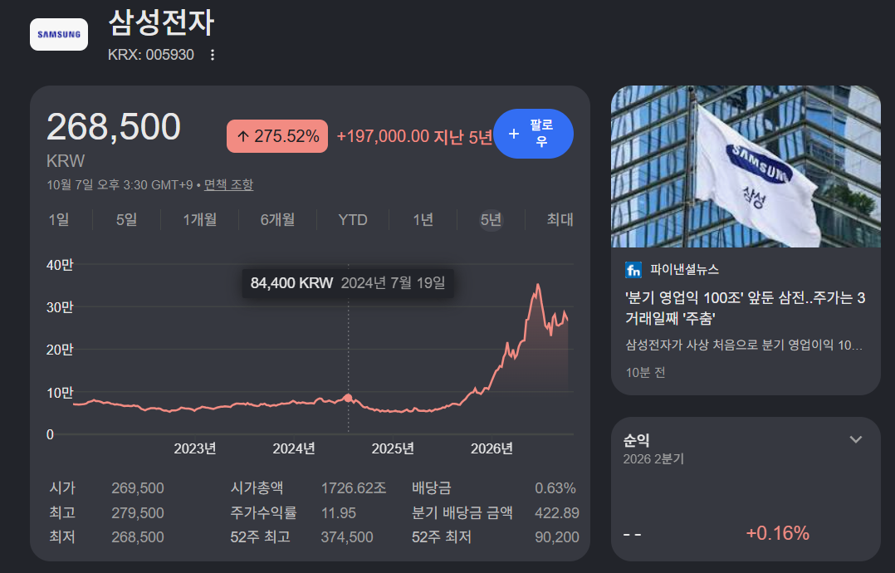
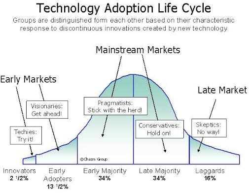

바이브 코딩 시리즈 글의 첫 번째로 과거 회상씬을 넣겠습니다.

때는 2023년 5월쯔음 코파일럿의 파일럿 테스트를 진행하고, 마음에 들어서 구독을 시작했습니다. 한 달에 10딸라면 거저라는 생각이 들더라구요. 그 때는 자동 완성이 핵심 기능인데, 손가락 관절 보호에 도움이 되었습니다.

결재 기록을 보니 1년 넘게 사용했군요. 2024년에는 회사에 도입될 줄 알았는데, 2024년 말까지 도입이 안되었습니다. 그 맘때 저는 AI에 확신을 갖고 신용대출 풀로 당겨서 삼성전자 주식을 매수했습니다. 메모리는 오를 수 밖에 없다!

제가 24년 7월 8층에서 매수했는데, 그 때부터 기다렸다는 듯이 빠지더니 -46% 내상을 입고 손절을 할 수 밖에 없었습니다. 그리고 나서 1년이 더 지나고 나서야 삼성전자는 다시 8층에 도달했습니다. 다행이도, 손절해서 하이닉스로 갈아타고 회복 할 수 있었습니다.

이 때 교훈은, 주가는 시장을 앞서지만 나는 시장보다 더 앞서있다는 것을 깨달았습니다. 자랑이 아니라 그냥 그렇다는 것입니다. 그래픽카드 사서 Stable Diffusion으로 이미지 만들면서 감탄하는 것이 시장에 오려면 시간이 걸린다는 것을 알았죠.

그렇게 주가 회복과 함께 맞이한 2025년, 커서를 만났습니다. 구독 결재 금액이 올라갔지만 이 친구는 더 많이 코드를 작성해 주었습니다.

그리고 2026년 Opus가 왔습니다. 제가 코드를 안보기 시작한 것은 Opus부터입니다. 그 전에는 제가 이해하지 못하는 코드는 반영하지 않았습니다. 지금은 파일 편집기를 열어보지도 않고 반영합니다.

아직도 SNS나 단톡방에 그런 글이 가끔 올라와요. 코드 리뷰 안하고 반영하는거 반대한다는, 용납할 수 없다는 글. 저도 공감합니다만 모든 코드에 그 기준을 적용하는 것은 좀 많이 뒤쳐진것 같아요.

제가 아내한테 요즘엔 내가 이렇게 일한다. 내가 하는 일이 또 이만큼 줄었다. 정말 빠르다 말하면서도 뭔가 제가 생각했던 것보다 엄청나게 빠르게 세상이 변하고 있지 않다는 느낌도 동시에 듭니다. 회사에서도 Agent와 Workflow에 대해서 사람들이랑 이야기할 때 문득 그런 생각이 들어요. 내가 또 너무 빨리 세상을 단정하는 것은 아닌가. 지금 매수 타이밍이 맞나? 신용대출 풀로 땡겨서 8개월간 마음 고생했던 순간을 떠올립니다.

어째든, 지금의 기록을 남겨보려고 합니다. 제가 곡선의 어디쯤에 있는지 두리번 거리면서...