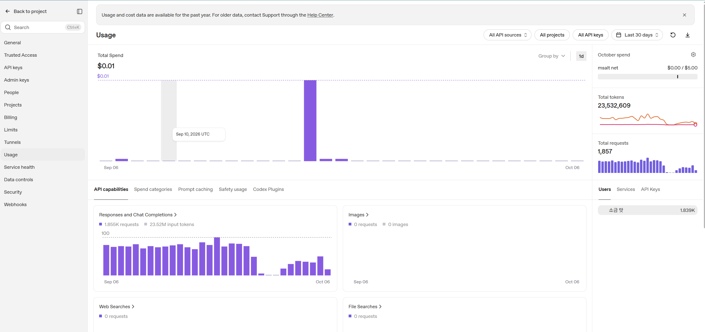

GPU가 없어서 허덕이는게 벌써 2년 이상 된것 같네요. 2년 전에 당근한 RTX2070을 들고 기뻐하던 저를 이상하게 보던 중학생 판매자가 생각이 납니다. GPU 가격이 내릴 줄 모르고, 메모리까지 합세해서 아주 곤란한 지경입니다.

GPU가 귀하니까 LLM API도 귀해서, 무료 클라우드 컴퓨타처럼 쉽게 무료 서비스를 찾을 수가 없었습니다. 그래도 API로 직접 Agent, Chatbot 하나씩은 가지고 있어야 간지가 나는데 말입니다.

지난번에는 [무료 클라우드 컴퓨타 사용하기!](../free-cloud-compute-for-agents/)에서 Agent를 올려 둘 무료 서버를 소개했는데요. 이번에는 우연히 알게되어서 잘쓰고 있는 무료 LLM API 꿀팁을 소개합니당. 😉

## 무료 API 비교

예전에는 Gemini 무료가 혜자였는데, 요즘은 좀 별로인 것 같아요. **2026년 10월 6일 기준**으로 간단히 비교해봤습니다.

| 서비스 | 대표 무료량 | 이럴 때 좋아요 |
| --- | --- | --- |
| [OpenAI Data Sharing](https://help.openai.com/en/articles/10306912-sharing-feedback-evaluation-and-fine-tuning-data-and-api-inputs-and-outputs-with-openai) | Tier 1~2: 경량 그룹 250만 + 상위 그룹 25만 토큰/일 | 데이터 공유가 괜찮은 개인용 Agent 운영 |
| [Gemini Free Tier](https://ai.google.dev/gemini-api/docs/rate-limits) | 대상 모델 입·출력 무료, 프로젝트별 호출 제한 | Gemini로 챗봇·요약 기능을 가볍게 실험 |
| [Groq GPT-OSS/Qwen](https://console.groq.com/docs/rate-limits) | 20만 토큰 + 1,000회/일 | 빠른 답변이 필요한 챗봇·짧은 요청 처리 |
| [OpenRouter 무료 모델](https://openrouter.zendesk.com/hc/en-us/articles/39501163636379-OpenRouter-Rate-Limits-What-You-Need-to-Know) | 기본 50회/일 | 여러 모델 비교·다른 API의 대체 호출 |

실제로 호출할 수 있는 횟수는 요청 길이, 분당 제한, 추론 토큰에 따라 달라져요. Gemini의 무료 가격은 [대상 모델 가격표](https://ai.google.dev/gemini-api/docs/pricing)에서 확인할 수 있습니다.

이러나 저러나 오늘의 주인공은 **OpenAI**입니다.

## OpenAI API 무료 사용방법

OpenAI는 무료가 아닙니다만, 무료로 사용하는 방법이 있습니다.

**API 입력과 출력을 공유하면 일일 무료 토큰을 주는 Data Sharing Incentive**입니다. 데이터를 주고 토큰을 받는 거래죠. ~~대한민국에서 이미 내 데이터는 공공재~~ 사실, 일반 요금제를 사용하는 경우도 사용자의 데이터가 모델에 학습된다고하니 민감 데이터는 언제, 어디서나 조심해야 합니다.

먼저 [데이터 공유 설정](https://platform.openai.com/settings/organization/data-controls)에서 **무료 일일 사용 혜택 대상이라는 안내가 있는지** 확인하세요. 아무나되는 것은 아닌데, 일단 API 버짓 5딸라 결제하면 바로 1티어 되는것 같아요. [공식 조건](https://help.openai.com/en/articles/10306912-sharing-feedback-evaluation-and-fine-tuning-data-and-api-inputs-and-outputs-with-openai)을 먼저 읽어보세요.

여기서 **API Usage Tier는 ChatGPT Plus/Pro 구독과 별개**입니다. Organization의 누적 API 결제액에 따라 올라가며, [현재 공식 기준](https://developers.openai.com/api/docs/guides/rate-limits)은 Tier 1이 **$5**, Tier 2가 **$50**, Tier 3가 **$100**부터입니다. ChatGPT에 월 구독료를 내고 있어도 여기서는 새 출발입니다. 저는 5딸라 결제하고 아직 무료 인센티브만 사용하고 있습니다.ㅋ

최근 한달 2천 3백만 토큰 사용했네요.

무료 토큰은 이 Tier를 두 묶음으로 나눕니다.

| API Tier | 상위 모델 그룹/일 | 경량 모델 그룹/일 |
| --- | --- | --- |
| Tier 1~2 | 25만 토큰 | **250만 토큰** |
| Tier 3~5 | 100만 토큰 | **1,000만 토큰** |

대상 계정이라면 **누적 $100에 도달하는 Tier 3부터 무료량이 4배**가 됩니다. 월 API 사용 한도에 적힌 `$100/month` 같은 숫자는 무료 크레딧이 아니니 헷갈리지 마세요. 쓸 수 있는 한도와 공짜로 주는 양은 다릅니다.

한도는 한국 시간 **매일 오전 9시**에 초기화됩니다.

## 무료 OpenAI API 모델별 비교

gpt-4mini부터 사용했었는데, 요즘은 GPT-5.6 Luna를 많이 사용합니다. 근데, 글을 쓰다가 알게된 사실이 **GPT-5.6 Terra와 Luna**가 같은 250만 토큰 풀이란 것입니다. 즉, 무료 사용량이 같다능!

| 모델 | Tier 1~2 무료 그룹 한도/일 | 일반 입력 / 출력 가격¹ | 써볼 용도 |
| --- | --- | --- | --- |
| [GPT-5.6 Sol](https://developers.openai.com/api/docs/models/gpt-5.6-sol) | 상위 그룹 **25만** | $4 / $20 | 어려운 코딩·설계·추론 |
| [GPT-5.6 Terra](https://developers.openai.com/api/docs/models/gpt-5.6-terra) | 경량 그룹 **250만** | $2 / $12 | 일반 질문·요약·Agent |
| [GPT-5.6 Luna](https://developers.openai.com/api/docs/models/gpt-5.6-luna) | 경량 그룹 **250만** | $0.20 / $1.20 | 분류·추출·대량 처리 |

¹ Standard API의 100만 토큰당 가격입니다. 캐시 입력·긴 컨텍스트 등은 별도 조건이 적용됩니다.

**Terra와 Luna가 각각 250만씩 받는 건 아닙니다.** Terra로 200만을 쓰면 Luna 등에 남는 양은 총 50만입니다. 같은 냉장고를 쓰는 식구예요. GPT-5.4 mini/nano 등도 이 풀을 공유합니다. ~~하..진즉 올릴껄...~~

GPT-6 Astra/Sol/Luna도 [현재 무료 대상 목록](https://help.openai.com/en/articles/10306912-sharing-feedback-evaluation-and-fine-tuning-data-and-api-inputs-and-outputs-with-openai)에 있습니다. 다만 모두 **25만 토큰의 상위 그룹**이고, GPT-6.1 Sol은 목록에 없습니다.

250만 토큰이면 요청당 2,000토큰 기준 **하루 약 1,250번**입니다. Agent가 한 작업에 여러 번 호출하거나 길게 생각하면 줄어들지만, 작은 개인 프로젝트에서는 꽤 여유가 있죠. [추론 토큰도 출력 사용량에 포함](https://developers.openai.com/api/docs/guides/reasoning)되니 최종 답변 길이만 보고 계산하면 안 됩니다.

금액으로 계산을 해보면, **Terra로 매일 250만 토큰을 전부 쓰고, 입력 80%·출력 20%라고 가정하면 30일에 정상 요금 약 $300 상당**입니다. 🐶꿀

근데, 요즘 서비스가 너무 좋아져서 API는 점점 멀어지네요. 돈 쓰는거에만 익숙해지면 안되는데.
